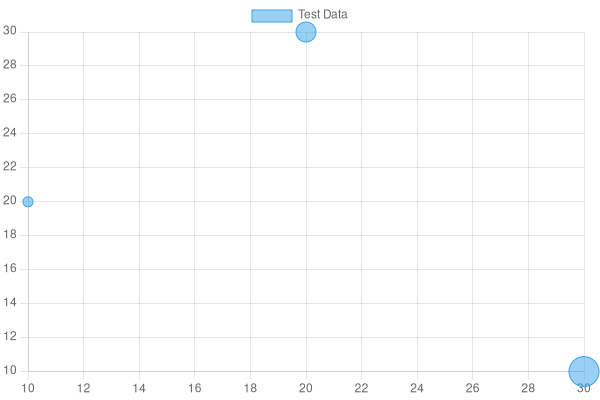

# imagine-graph
<div style="display: flex;">

[](https://www.npmjs.com/package/imagine-graph)

[](https://codeclimate.com/github/pariazar/imagine-graph/maintainability)
[](https://github.com/pariazar/imagine-graph/issues)
[](https://opensource.org/licenses/MIT)

</div>
<p align="center">

</p>
This npm package offers a user-friendly way to create interactive charts, graphs, and maps from various data sources. With its intuitive interface and powerful tools, users can easily generate stunning visualizations to better understand their data and communicate insights to others.
</br>

### Install the package:

```bash
npm install imagine-graph
```


### Bar Chart
<p align="center">

</p>
To use the chart functions, you first need to install the npm package and import the relevant function(s) into your project. Here's an example of how to use the createBarChart function:
</br>
Import the createBarChart function into your project:

```javascript
const { createBarChart } = require('imagine-graph');
```

Call the createBarChart function with your data and options:

```javascript
const data = [
    { label: 'A', value: 10 },
    { label: 'B', value: 20 },
    { label: 'C', value: 30 },
    { label: 'D', value: 15 },
];

const options = {
    title: 'My Bar Chart',
    width: 600,
    height: 400,
    backgroundColor: '#ffffff',
    borderColor: '#75a485',
    titleColor: '#75a485',
    labelColor: '#75a485',
    borderWidth: 2
};

createBarChart(data, options, './mychart.png')
    .then(filePath => {
        console.log(`Chart saved to ${filePath}`);
    })
    .catch(error => {
        console.error('Error creating chart:', error);
    });

```

or can access buffer by calling following method and don't pass path
```javascript
// To get the image buffer
const imageBuffer = await createBarChart(data, options);
console.log(imageBuffer);
// <Buffer 89 50 4e 47 0d 0a 1a 0a 00 00 00 0d 49 48 44 52 00 00 03 20 00 00 02 58 08 06 00 00 00 9a 76 82 70 00 00 00 06 62 4b 47 44 00 ff 00 ff 00 ff a0 bd a7 ... 36691 more bytes>
```
<hr>
## Line Chart

<p align="center">

</p>
Import the createLineChart function into your project:

```javascript
const { createLineChart } = require('imagine-graph');
```

Call the createLineChart function with your data and options:

```javascript
const data = [
    { label: 'A', value: 10 },
    { label: 'B', value: 20 },
    { label: 'C', value: 30 },
    { label: 'D', value: 15 },
];

const options = {
    title: 'My Line Chart',
    width: 600,
    height: 400,
    backgroundColor: '#ffffff',
    borderColor: '#75a485',
    titleColor: '#75a485',
    labelColor: '#75a485',
    borderWidth: 2
};

createLineChart(data, options, './mychart.png')
    .then(filePath => {
        console.log(`Chart saved to ${filePath}`);
    })
    .catch(error => {
        console.error('Error creating chart:', error);
    });
```

or can access buffer by calling following method and don't pass path

```javascript
// To get the image buffer
const imageBuffer = await createLineChart(data, options);
console.log(imageBuffer);
// <Buffer 89 50 4e 47 0d 0a 1a 0a 00 00 00 0d 49 48 44 52 00 00 03 20 00 00 02 58 08 06 00 00 00 9a 76 82 70 00 00 00 06 62 4b 47 44 00 ff 00 ff 00 ff a0 bd a7 ... 36691 more bytes>
```

<hr>

## Bubble Chart
<p align="center">

</p>

The createBubbleChart function allows you to create an interactive bubble chart from a given dataset. The chart can be customized with various options to match your needs.
</br>
To use the <strong>createBubbleChart</strong> function, you need to first import it from the imagine-graph package:

```javascript
const { createBubbleChart } = require('imagine-graph');
```

Then, you can call the createBubbleChart function with your data and options:

```javascript
const data = [
    { x: 10, y: 20, r: 5, label: 'A' },
    { x: 20, y: 30, r: 10, label: 'B' },
    { x: 30, y: 10, r: 15, label: 'C' },
    { x: 15, y: 25, r: 8, label: 'D' },
];

const options = {
    title: 'My Bubble Chart',
    width: 600,
    height: 400,
    backgroundColor: '#ffffff',
    borderColor: '#75a485',
    titleColor: '#75a485',
    labelColor: '#75a485',
    borderWidth: 2,
    tooltip: function(d) {
        return `(${d.x}, ${d.y}): ${d.r}`;
    },
    xLabel: 'X Axis Label',
    yLabel: 'Y Axis Label',
    xTicks: 10,
    yTicks: 5,
    xTickCount: 5,
    yTickCount: 5,
};

createBubbleChart(data, options, './mychart.png')
    .then(filePath => {
        console.log(`Chart saved to ${filePath}`);
    })
    .catch(error => {
        console.error('Error creating chart:', error);
    });

```

The path argument is the path where the chart image will be saved.
</br>
Alternatively, you can access the image buffer by calling the createBubbleChart function without the path argument:

```javascript
const imageBuffer = await createBubbleChart(data, options);
console.log(imageBuffer);
// <Buffer ...>
```
<hr>

## Pie Chart
<p align="center">

</p>

Import the createPieChart function into your project:

```javascript
const { createPieChart } = require('imagine-graph');
```
Call the createPieChart function with your data and options:

```javascript
const data = [
    { label: 'A', value: 10 },
    { label: 'B', value: 20 },
    { label: 'C', value: 30 },
    { label: 'D', value: 15 },
];

const options = {
    title: 'My Pie Chart',
    width: 600,
    height: 400,
    backgroundColor: '#ffffff',
    borderColor: '#75a485',
    titleColor: '#75a485',
    labelColor: '#75a485',
    borderWidth: 2
};

createPieChart(data, options, './mychart.png')
    .then(filePath => {
        console.log(`Chart saved to ${filePath}`);
    })
    .catch(error => {
        console.error('Error creating chart:', error);
    });
```

Call the createPieChart function with your data and options:

```javascript
// To get the image buffer
const imageBuffer = await createPieChart(data, options);
console.log(imageBuffer);
// <Buffer 89 50 4e 47 0d 0a 1a 0a 00 00 00 0d 49 48 44 52 00 00 03 20 00 00 02 58 08 06 00 00 00 9a 76 82 70 00 00 00 06 62 4b 47 44 00 ff 00 ff 00 ff a0 bd a7 ... 26337 more bytes>
```

<hr>

## Scatter Chart

<p align="center">

</p>

Import the createScatterChart function into your project:

```javascript
const { createScatterChart } = require('imagine-graph');
```

Call the createScatterChart function with your data and options:

```javascript
const data = [
    { x: 1, y: 10 },
    { x: 2, y: 20 },
    { x: 3, y: 30 },
    { x: 4, y: 15 },
];

const options = {
    title: 'My Scatter Chart',
    width: 600,
    height: 400,
    backgroundColor: '#ffffff',
    borderColor: '#75a485',
    titleColor: '#75a485',
    labelColor: '#75a485',
    borderWidth: 2,
    xAxisLabel: 'X-Axis',
    yAxisLabel: 'Y-Axis'
};

createScatterChart(data, options, './mychart.png')
    .then(filePath => {
        console.log(`Chart saved to ${filePath}`);
    })
    .catch(error => {
        console.error('Error creating chart:', error);
    });
```

Or you can access the image buffer by calling the following method and not pass a path:

```javascript
// To get the image buffer
const imageBuffer = await createScatterChart(data, options);
console.log(imageBuffer);
// <Buffer 89 50 4e 47 0d 0a 1a 0a 00 00 00 0d 49 48 44 52 00 00 03 20 00 00 02 58 08 06 00 00 00 9a 76 82 70 00 00 00 06 62 4b 47 44 00 ff 00 ff 00 ff a0 bd a7 ... 26337 more bytes>
```

## Support
  - [Bug Reports](https://github.com/pariazar/imagine-graph/issues/)

## Contributors
<p>
Pull requests are always welcome! Please base pull requests against the main branch and follow the contributing guide.

  - [Contributors](https://github.com/pariazar/imagine-graph/blob/main/CONTRIBUTING.md)


if your pull requests makes documentation changes, please update readme file.
</p>

## License

This project is licensed under the terms of the
MIT license
